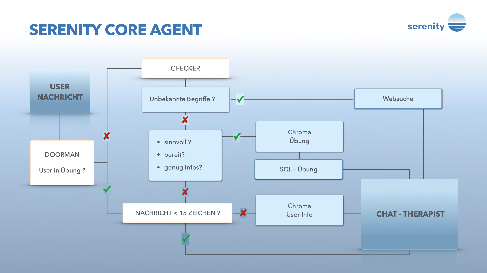
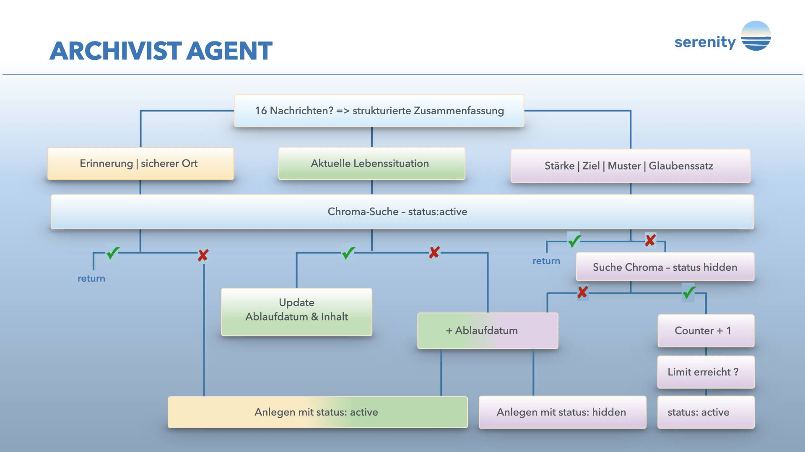
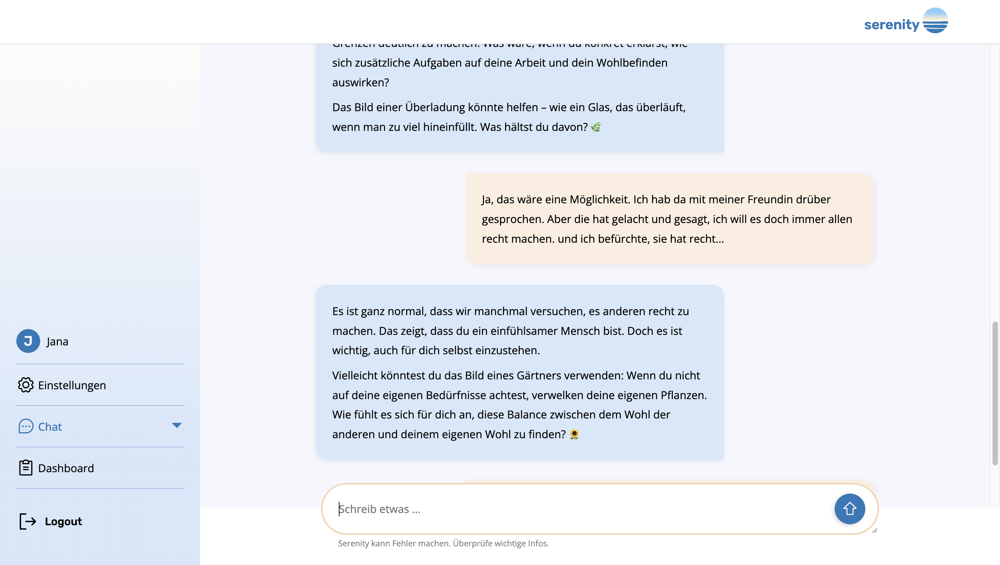
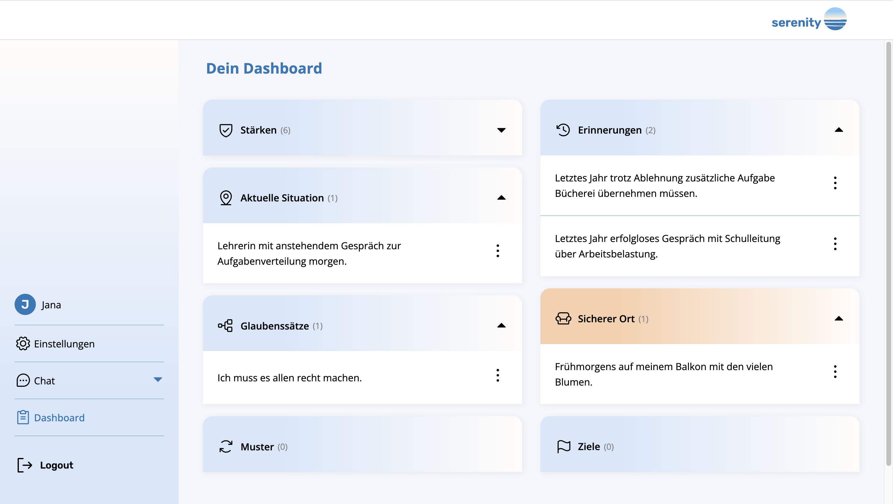
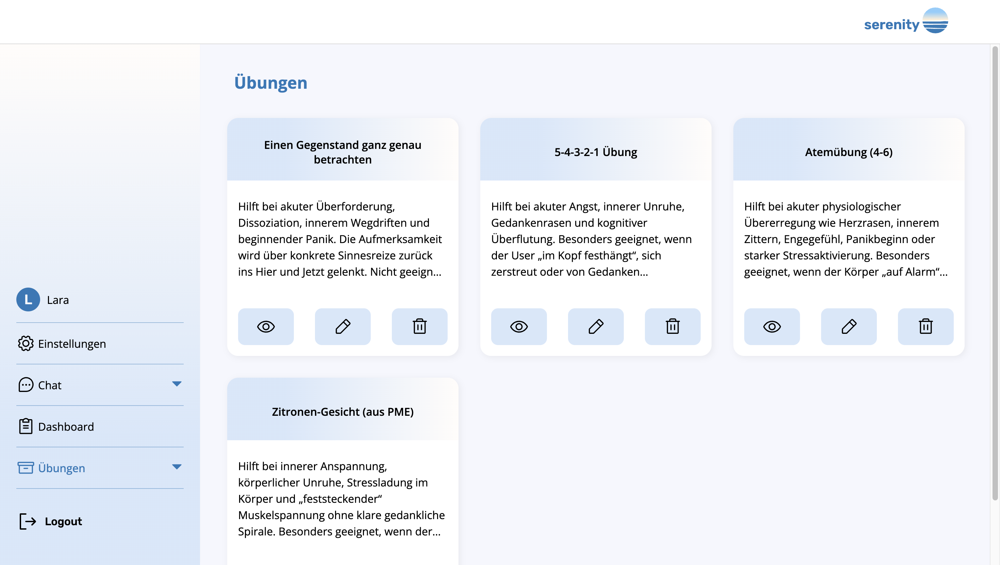

# Serenity

AI-powered self-reflection and personal growth platform with persistent memory, contextual awareness, and evidence-based insight generation.

Serenity is a full-stack AI application designed to support personal growth through long-term conversational interaction. Unlike traditional chatbots, Serenity builds a structured memory of the user over time, retrieves relevant context when needed, and generates insights only after sufficient evidence has been collected.

The system combines conversational AI, semantic memory retrieval, intelligent exercise selection, and multi-agent orchestration to create a personalized and evolving user experience.

---

## Features 


### Persistent Long-Term Memory

Serenity continuously extracts relevant information from conversations and stores it in a structured memory system.

The memory is organized into seven categories:

* Current Situation
* Memory
* Safe Place
* Goal
* Strength
* Pattern
* Belief

Each memory entry contains metadata such as creation date, expiration date, status, and additional reasoning where applicable.

---
### Guided Onboarding

Before accessing the chat for the first time, users complete a short onboarding process.

The onboarding collects a small set of user-provided information:

* Age (optional)
* Gender (optional)
* Personal strengths selected from a predefined list
* A personally meaningful safe place

These initial inputs serve as verified user data and provide Serenity with reliable context from the beginning of the relationship.

This approach reduces the cold-start problem often found in conversational AI systems and enables more personalized interactions from the first conversation onward.

Selected strengths are stored as confirmed strengths rather than AI-generated assumptions.

The safe place can later be used as part of stabilization and grounding interventions when appropriate.

--- 

### Evidence-Based Insight Generation

To reduce incorrect assumptions, Serenity does not immediately expose inferred beliefs, goals, strengths, or behavioral patterns.

Potential insights are initially stored as hidden entries.

Each time similar evidence appears in future conversations, an internal confidence counter increases.

Only after reaching predefined confidence thresholds are insights promoted to active status and made available to both the user and the AI system.

This mechanism helps reduce false positives and encourages reliable long-term understanding.

---

### Context-Aware Conversations

Before generating a response, Serenity searches its memory database for relevant information related to the user's current topic.

The conversational agent can therefore:

* Recognize recurring themes
* Reference previously discussed situations
* Highlight behavioral patterns
* Reinforce personal strengths
* Maintain long-term continuity

Additionally, the five most recent "Current Situation" entries are always available as contextual information.

---

### Intelligent Exercise System

Serenity includes a semantic exercise retrieval system designed to support users during moments of emotional overwhelm.

Before each response, a separate analysis process evaluates whether the user is:

* Dissociating
* Stuck in repetitive thought loops

If an intervention may be beneficial, the system:

1. Creates a structured summary of the user's state.
2. Performs a similarity search against the exercise database.
3. Compares the resulting similarity score.
4. Starts the exercise only if a sufficiently relevant match is found.

Otherwise, the conversation continues naturally.

This prevents unnecessary or inappropriate interventions.

---

### Memory Lifecycle Management

Different memory categories follow different retention strategies.

Examples:

* Current situations automatically expire after three weeks, unless the user mentions them again in the chat, in which case they are extended accordingly.
* Goals, strengths, beliefs, and patterns expire after twenty-two weeks,unless they are confirmed beforehand and become active. 
  Likewise, if the counter is close to the legal limit, they do not expire.
* Safe places remain permanently available.
* Users can convert current situations into permanent memories.

This approach helps keep the memory system relevant while preventing data accumulation.

---

### User Dashboard

Users can review all active insights generated by the system.

The dashboard allows users to:

* View stored memories
* Review detected strengths
* Explore recurring patterns
* Inspect inferred beliefs
* Read the reasoning behind AI-generated conclusions
* Delete entries at any time

This ensures transparency and user control over the memory system.

---

### Exercise Administration Panel

Serenity contains a hidden administration interface for managing exercises.

Administrators can:

* Create exercises
* Edit exercises
* Delete exercises
* Review exercise metadata

The administration panel supports the semantic retrieval workflow used by the conversational agent.

---


## Multi-Agent Design

Serenity uses two specialized AI agents.

### Serenity Core Agent



Responsibilities:

* User conversations
* Context retrieval
* Memory retrieval
* Exercise initiation
* Web search integration
* Response generation

Model:

`gpt-4o-mini`

### Archivist Agent



Responsibilities:

* Conversation analysis
* Information extraction
* Memory management
* Similarity validation
* Memory lifecycle maintenance

Model:

`gpt-4.1-mini`

The Archivist Agent operates entirely in the background and remains invisible to the user.

---

## Memory System

Serenity uses a structured long-term memory system designed to balance personalization with reliability.

Instead of immediately treating every AI-generated observation as a fact, the system distinguishes between **hidden** and **active** memory entries.

### Hidden Memories

Potential goals, strengths, beliefs, and behavioral patterns are initially stored as hidden memories.

These entries are not visible to the user and are not available to the conversational agent.

Each hidden memory contains:

* The extracted insight
* Supporting reasoning generated by the AI
* The category such as belief, pattern, goal or strengths
* the user_id
* A confidence counter
* Metadata such as creation and expiration dates

When similar observations appear in future conversations, Serenity performs a semantic similarity search to determine whether the new information supports an existing hidden memory.

If a match is found, the confidence counter is increased and the entry is updated with the latest evidence.

### Active Memories

A hidden memory becomes active only after accumulating sufficient evidence over time.

Different memory types require different confidence thresholds before activation:

* Goals: 3 confirmations
* Strengths: 3 confirmations
* Patterns: 10 confirmations
* Beliefs: 10 confirmations

Once activated, the memory becomes:

* Visible in the user dashboard
* Available to the conversational agent
* Part of the user's long-term profile

### Explainable Insights

For goals, strengths, beliefs, and patterns, Serenity stores the reasoning behind each observation.

Users can review these explanations within the dashboard to understand why a particular insight was generated and which conversational evidence contributed to it.

### Memory Lifecycle

To prevent outdated information from influencing future conversations, most memory categories include expiration dates.

When an item reaches its expiration date, it is automatically removed from the system.

This ensures that Serenity's understanding remains relevant and reflects the user's current situation rather than outdated assumptions.

The overall design prioritizes evidence accumulation, transparency, and user control, helping reduce premature conclusions while maintaining meaningful long-term personalization.

### Current Situation Tracking

Current situations are treated differently from long-term insights.

Instead of requiring evidence accumulation, they are stored immediately and remain active for three weeks.

Whenever a similar situation is detected again, its expiration date is extended.

This mechanism allows Serenity to maintain awareness of topics that are currently relevant in the user's life while automatically removing outdated context over time.

Users can permanently preserve important situations by converting them into long-term memories through the dashboard.


---

## Technology Stack

### Backend

* FastAPI
* Python
* SQLAlchemy
* SQLite
* ChromaDB
* LangGraph
* LangChain
* OAuth2

### Frontend

* React
* CSS Modules
* Radix UI
* React Hot Toast
* Phosphor Icons

### AI & Observability

* OpenAI
* Tavily Search
* Langfuse

---
## Project Structure

```text
Serenity
│
├── frontend
│   └── src
│       ├── pages
│       ├── components
│       └── layout
│
└── backend
    ├── main.py
    │
    ├── data
    │   ├── SQLite database
    │   └── ChromaDB storage
    │
    └── app
        ├── ai
        │   └── LangGraph agents
        ├── core
        │   └── Utility functions
        ├── models
        │   └── SQLAlchemy models
        ├── schemas
        │   └── Pydantic schemas
        └── services
            ├── User service
            ├── User Property service
            └── Vector service
```

Serenity follows a monorepo structure containing a React frontend and an asynchronous FastAPI backend. Persistent data is stored in SQLite and ChromaDB, while AI-related functionality is organized into dedicated agent, service, and schema layers.

```

---

## Installation

### Clone Repository

```bash
git clone https://github.com/katja-roehlig/serenity.git
cd serenity
```

### Backend Setup

```bash
cd backend

python -m venv venv

source venv/bin/activate
# Windows:
# venv\Scripts\activate

pip install -r requirements.txt
```

### Frontend Setup

```bash
cd frontend

npm install

```
### Create Required Data Directory

Before starting the backend, create the data directory used by SQLite and ChromaDB.

```bash
mkdir backend/data
```

The SQLite database file and ChromaDB storage will be created automatically when the application starts for the first time.

---

## Environment Variables

Create a `.env` file inside the backend directory.

```env
OPENAI_API_KEY=
TAVILY_API_KEY=
LANGFUSE_PUBLIC_KEY=
LANGFUSE_SECRET_KEY=
LANGFUSE_BASE_URL=
```

---

## Running the Application

### Backend

```bash
cd backend

uvicorn main:app --reload
```

### Frontend

```bash
cd frontend

npm run dev
```

---

## Future Development

Planned improvements include:

* Route protection enhancements
* Logout functionality
* Responsive mobile design
* User-editable memory entries
* Persistent chat history storage
* Deployment pipeline
* Third AI agent for guided personal development plans
* Scheduled reminders and progress tracking

---

## Screenshots

### Authentication


### Chat Interface



### User Dashboard



### Exercise Overview



---

## License

This project was created for educational and portfolio purposes.
